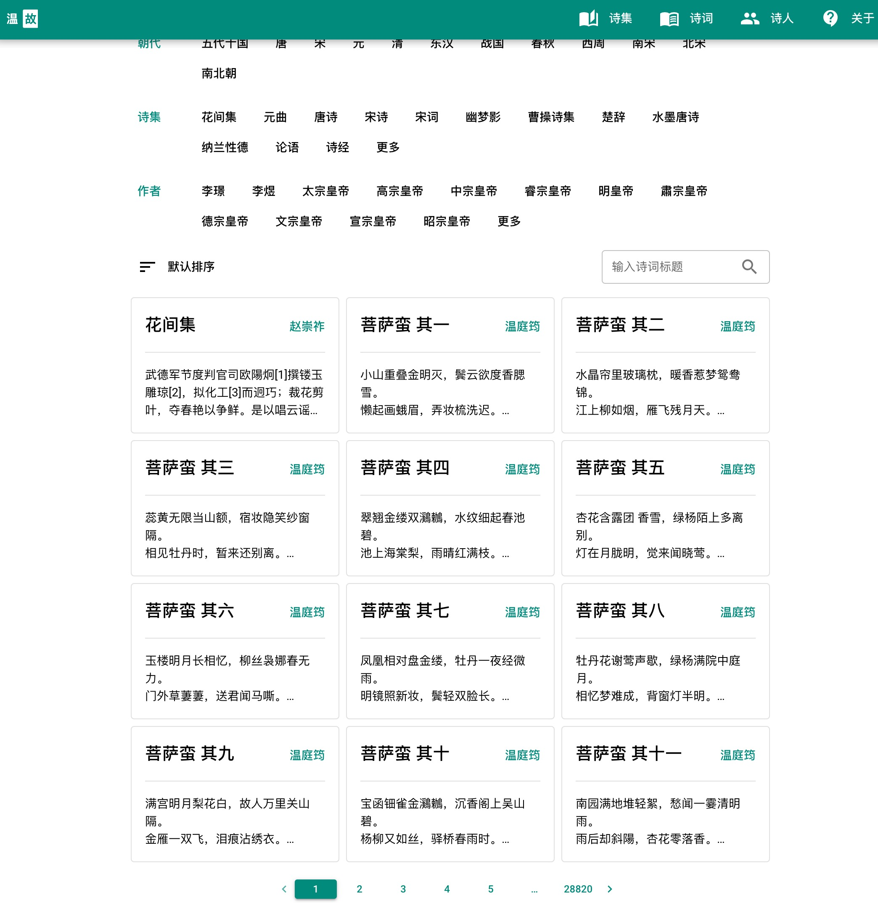

# 温故
使用 **Go** 写的中华古诗词接口，诗词数据来源 [chinese-poetry](https://github.com/chinese-poetry/chinese-poetry)

## 如何使用?
1. 下载仓库
```
git clone --recurse-submodules https://github.com/honmaple/maple-poetry
cd maple-poetry
```
2. 编译二进制文件
```
docker build -t maple-poetry .
```
或者使用编译好的镜像
```
docker pull honmaple/poetry
```
3. 创建数据库并且导入数据
```
docker run --rm -it -v `pwd`/example:/opt/poetry -v `pwd`/chinese-poetry:/opt/chinese-poetry maple-poetry ash
/opt/poetry # poetry init --path /opt/chinese-poetry --insert
```
喝杯奶茶并且等待片刻，`example` 目录下将会生成一个`poetry.db` 数据库文件

4. 运行服务
```
docker run --name maple-poetry -d -p 8000:8000 -v `pwd`/example:/opt/poetry maple-poetry
```

## 演示
[demo](https://shici.honmaple.com)

## 截图


