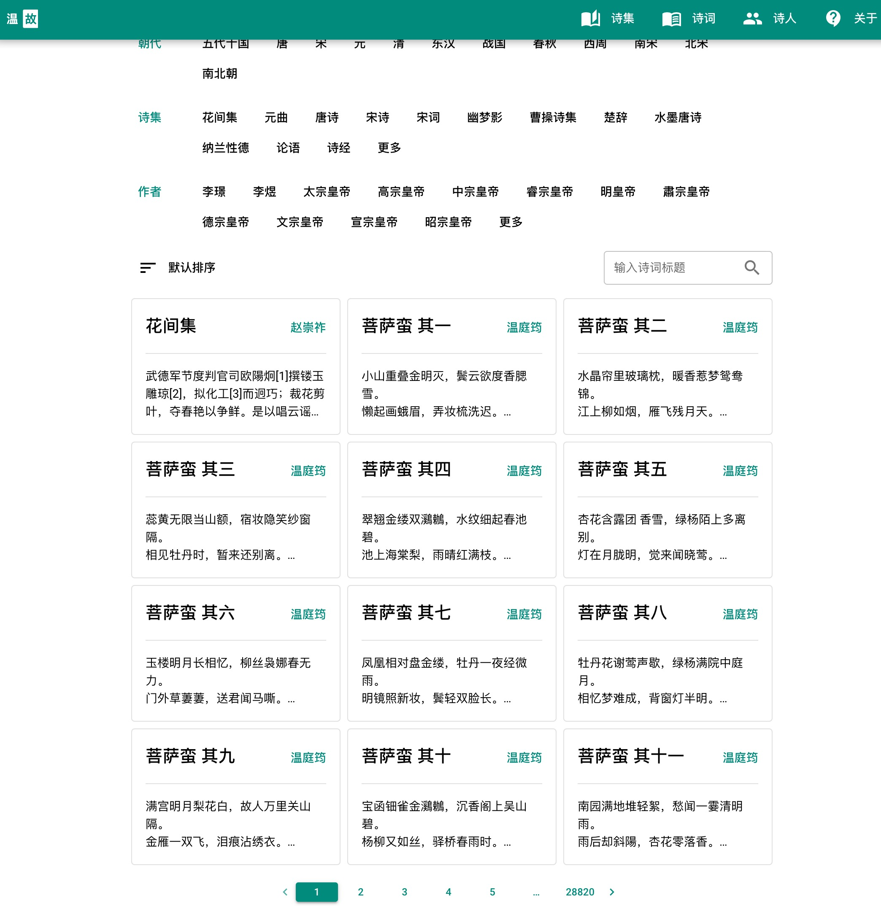

# maple-poetry
chinese poetry by golang

## How to use?
1. Download repo
```
git clone --recurse-submodules https://github.com/honmaple/maple-poetry
cd maple-poetry
```
2. Build `poetry` bin file
```
docker build -t maple-poetry .
```
3. Create database and load data
```
docker run --rm -it -v `pwd`/example:/opt/poetry -v `pwd`/chinese-poetry:/opt/chinese-poetry maple-poetry ash
/opt/poetry # poetry init --path /opt/chinese-poetry --insert
```
Have a cup of coffee and wait for a while, then `poetry.db` would be generated in then `example` directory

4. Run server
```
docker run --name maple-poetry -d -p 8000:8000 -v `pwd`/example:/opt/poetry maple-poetry
```

## Demo

[demo](https://shici.honmaple.com)

## Screenshot

